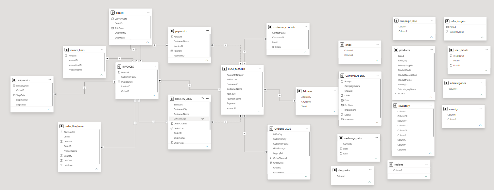
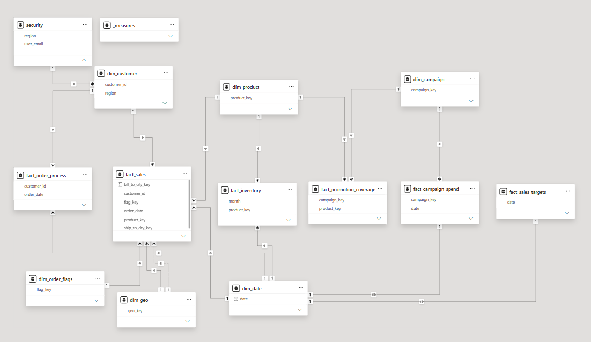

# Power BI Messy Data Model

Practice project: taking a deliberately messy spreadsheet and turning it into a clean, working data model in Power BI.

## Overview

I was given a spreadsheet with 23 unrelated-looking sheets — inconsistent names, duplicated tables, a couple of things that turned out to be unused decoys — and had to figure out how it all fit together, then build it into a proper Power BI model. This repo is that process: the messy starting point, the model I ended up with, and the notes I kept along the way so I (or anyone else) can understand the decisions later.

This exercise, and the approach behind it, comes from Data With Baraa's Power BI course, where he walks through exactly this kind of messy-to-modeled process.

## The problem

No defined structure, several tables overlapping or contradicting each other, and no way to build anything reliable on top of it as-is. The goal was to turn that into one model I could actually trust.

## What I tried to do

- Understand what each of the 23 sheets actually was, and what it was for.
- Spot duplicates and sheets that didn't end up being used.
- Group things into dimensions that could be shared across different fact tables, instead of repeating them.
- Pick one naming convention and stick to it everywhere.
- Write it all down, so the model makes sense to someone opening it cold.

## Dataset

`dataset.xlsx` — 23 sheets covering customers, orders (2025 and 2026 in separate sheets), invoices, payments, shipments, products, campaigns, inventory, sales targets, and a security/permissions sheet. None of them were ready to use on their own.

## Tools

- Power BI Desktop — Power Query for cleaning, then the modeling side for relationships and measures

## How I got from messy to modeled

1. **Went through every sheet first** before changing anything — checking what each one actually contained. That's how I found `Sheet1` was an exact duplicate of `shipments`, and that `exchange_rates` didn't connect to anything else in the data (no sheet even had a currency column), so it never made it into the model.
2. **Matched up IDs that didn't obviously match** — `user_details.UserID` and `CUST_MASTER.CustomerID` turned out to be the same identifier under a different name, so `user_details` became part of the customer table instead of its own thing.
3. **Built shared dimensions** (customer, product, date, campaign, geography, order flags) instead of letting each fact table have its own private copies.
4. **Kept fact tables at the right grain** — for example, sales is tracked at the line-item level, while order processing is tracked at the order level, even though both come from overlapping source sheets.
5. **Settled naming conventions before building anything**, documented in [`docs/schema_conventions.md`](docs/schema_conventions.md).
6. **Added a security table** to restrict what each user can see, by region.
7. **Wrote it all up** in [`docs/data_dictionary.md`](docs/data_dictionary.md) — every table, every column, where it came from.

## Before / After

**Before** — 23 raw, disconnected sheets:


**After** — the model I built from them:



## Repository Structure

```
power-bi-messy-data-model/
├── data/
│   └── dataset.xlsx
├── powerbi/
│   └── project_datamodel.pbix
├── docs/
│   ├── schema_conventions.md
│   └── data_dictionary.md
├── images/
│   ├── before-model.png
│   └── after-model.png
├── LICENSE
└── README.md
```

## Author

**Roger Muñoz** — [LinkedIn](https://www.linkedin.com/in/roger-muñoz-259378375) · [GitHub](https://github.com/RogerMunozTura)
